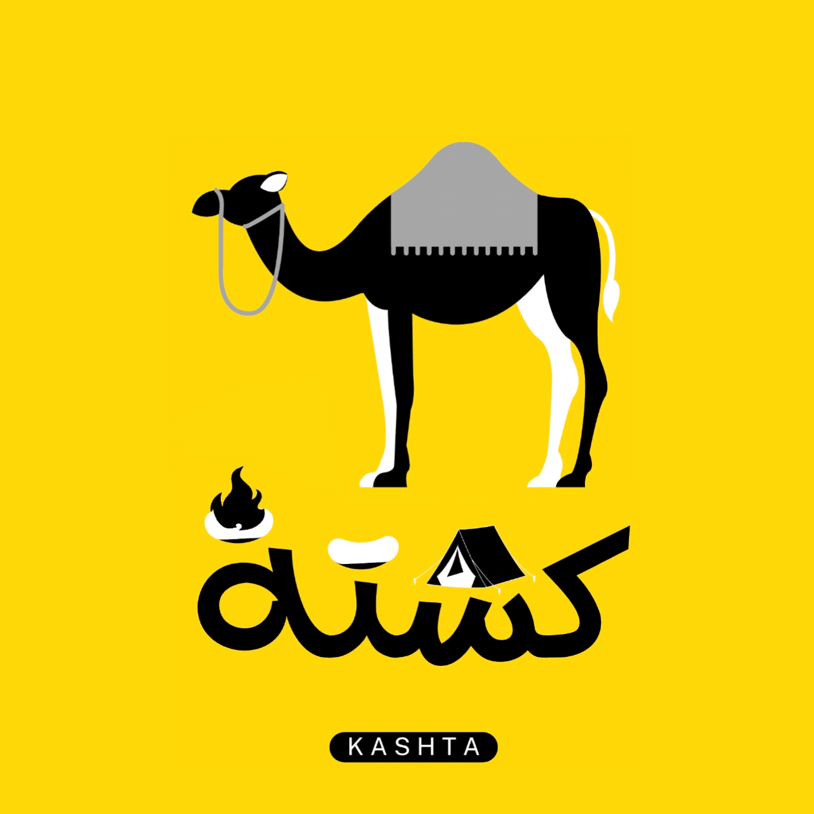

<!DOCTYPE html>
<html lang="ar">
<head>
<meta charset="UTF-8">
<title>Kashta</title>
<meta name="viewport" content="width=device-width, initial-scale=1">

</head>

<body>

  
  <h1>كشـتة | Kashta</h1>

  <a class="button" href="https://wa.me/9647501711734" target="_blank">💬 واتساب 1</a>
  <a class="button" href="https://wa.me/9647715939273" target="_blank">💬 واتساب 2</a>
  <a class="button" href="tel:+9647729434304">📞 اتصال مباشر</a>

  <a class="button" href="https://www.facebook.com/share/1DU6fML3JC/" target="_blank">📘 فيسبوك</a>
  <a class="button" href="https://www.instagram.com/kashta70_" target="_blank">📷 إنستغرام</a>
  <a class="button" href="https://www.tiktok.com/@kashta70" target="_blank">🎵 تيك توك</a>

</body>
</html>
